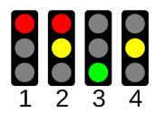
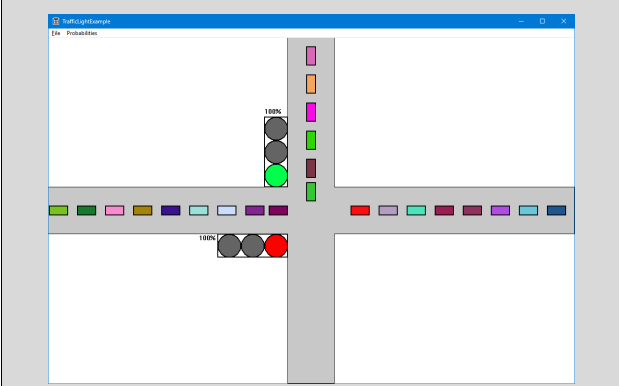

# DAT154 – Assignment 1

**Purpose:**  
Graphics and timers in SDK.

**Note:**  
During this assignment you can choose if you want to make your program object-oriented or not, and if you want to use bitmaps or just plain brushes.  
If you feel confident, feel free to use either object-oriented, bitmaps, or both, but the assignment will be simpler if you use neither.

---

## Part 1: Make a Simple Traffic Light

Make a static traffic light that is drawn on the screen. Use brush and circles. The traffic lights are standard lights with red, yellow, and green.

- The logic for creating the traffic light must be put into the `WM_PAINT` part of the program.
- The traffic light shall change state by pressing down the left mouse button (`WM_LBUTTONDOWN`).
- Study `InvalidateRect`, for example on Google.
- Lights should change according to the normal pattern for traffic lights:

---

## Part 2: Make Two Traffic Lights

Make two simple roads that cross each other and place two traffic lights by the crossing.

To simplify:

- Traffic is only in one direction:
  - Top → Bottom
  - Left → Right

The traffic lights should change when pressing down the left mouse button (`WM_LBUTTONDOWN`).

Note that you don’t need to draw the actual traffic yet, only the lights and the road itself.

---

## Part 3: Timer

Study `WM_TIMER` and general information about timers in the help system.

Use timers to simulate the traffic lights so that the traffic lights change automatically.

- Select your own interval.

---

## Part 4: Cars

You shall now introduce cars.

- Cars shall arrive from **west** by pressing the **left mouse button**.
- Cars shall arrive from **north** by pressing the **right mouse button**.

Cars may be drawn as:

- a square  
- an X  
- or as a bitmap if you prefer  

Decide for yourself if you want to make the program object-oriented or not.

### Car Behavior Rules

The cars must follow the traffic rules:

- Stop on red light at the crossing.
- Drive when the light is green.
- Cars must not crash into each other.

While a stack of cars can be a legit data structure, it is not a desirable outcome in the real world.

Use a timer for updating the position of the cars.

---

## Part 5: Automation

Now change the program so:

- Cars from west arrive with a probability **pw** per second.
- Cars from north arrive with a probability **pn** per second.

`pw` and `pn` should be set in a dialog.

You now have a traffic simulator and can study how queues build up in the traffic crossing.

---

## Part 6: WM_KEYDOWN

Read about `WM_KEYDOWN`.

Make the program so that you change the intensities `pn` and `pw` with ±10% by pressing the following keys:

- **Left / Right arrow keys** → change west intensity (`pw`)
- **Up / Down arrow keys** → change north intensity (`pn`)

You can now change `pw` and `pn` dynamically by pressing these keys.

---

### Final Note

Just an example for how the final program can look:

You don’t have to try to make it look exactly like any provided example.  
Your program can be more or less fancy:

- bigger cars  
- larger roads  
- bitmaps  
- more lanes  
- 4-way traffic  

Whatever you want – this is just to give you a very rough idea.

